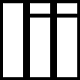

  
Large Image Inference

#### Installation
`pip install git+git://github.com/Cyril-Meyer/lii`


#### Usage
import module :  
```
from lii import LargeImageInference as lii
```
call function :  
```
lii.infer(3d_image, sliding_window_shape, function_to_apply, overlap_1_or_2)
```

If 3d_image is not a multiple of sliding_window_shape (padding is added to 3d_image) :  
```
lii.infer_pad(3d_image, sliding_window_shape, function_to_apply, overlap_1_or_2)
```
If function_to_apply shrinks the input (e.g. valid convolution) :  
```
lii.infer_out_smaller(3d_image, sliding_window_input_shape, sliding_window_output_shape, function_to_apply, overlap_1_or_2)
```

More usage example in [test.py](test.py)
